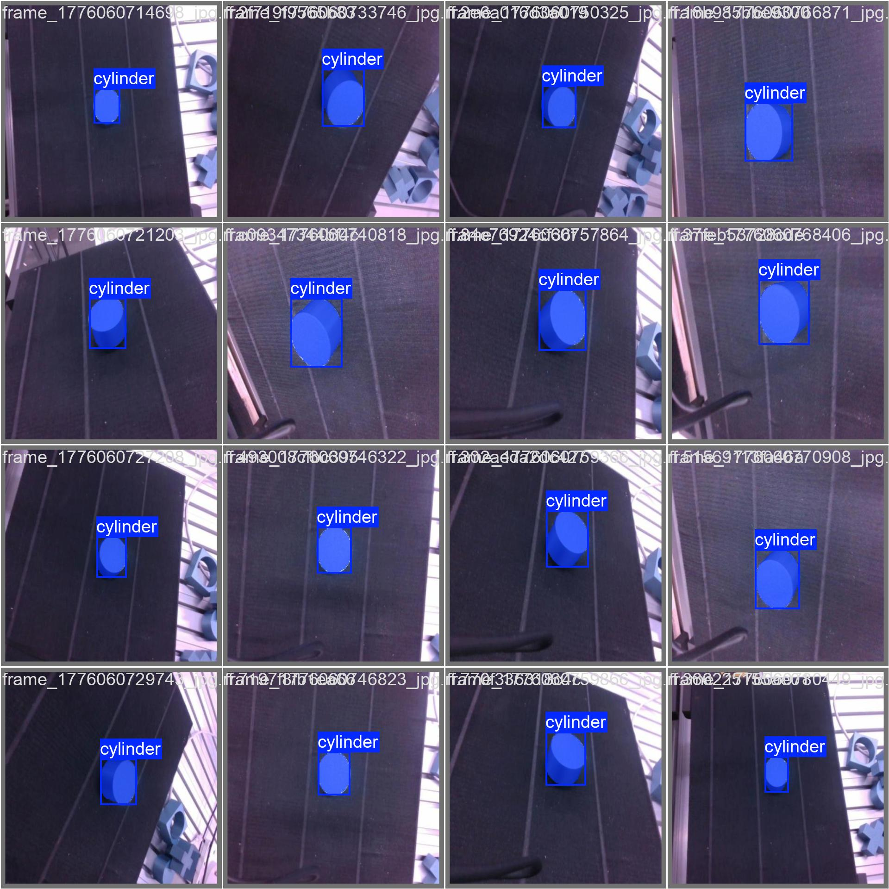
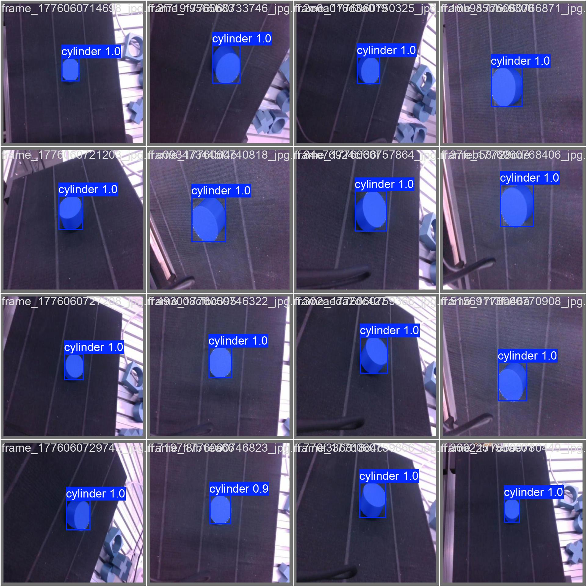
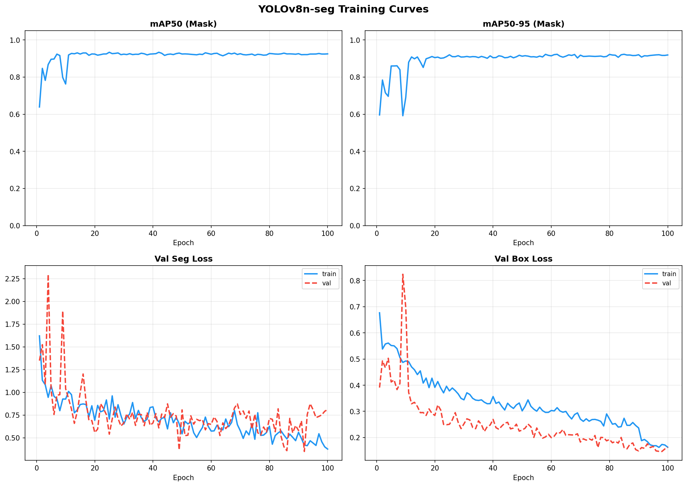
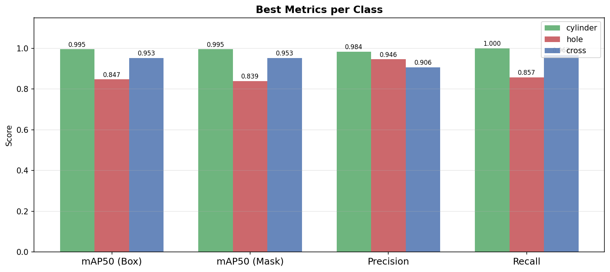
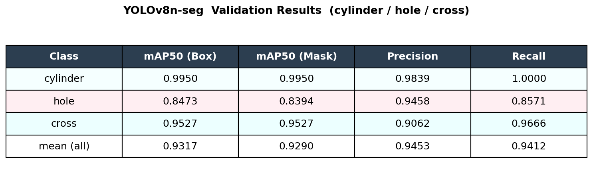

# RGB-D Object Pose Estimation

Real-time 3D object detection and pose estimation using Intel RealSense D455 and YOLOv8 instance segmentation. Detects three industrial parts (cylinder, hole, cross) and outputs their **3D coordinates (X, Y, Z)** and **orientation angle** in real time.

---

## Demo

> Real-time inference: each detected object is overlaid with a segmentation mask, a centroid marker, and an orientation arrow. 3D pose is printed to the terminal and optionally published as a ROS2 topic.

**Validation predictions**

| Labels | Predictions |
|--------|-------------|
|  |  |

**Training curves**



mAP50 converges above 0.93 within 20 epochs and remains stable through 100 epochs. Train/val loss decreases together — no overfitting.

**Per-class metrics**





| Class    | mAP50 (Box) | mAP50 (Mask) | Precision | Recall |
|----------|:-----------:|:------------:|:---------:|:------:|
| cylinder |   0.9950    |    0.9950    |   0.9839  | 1.0000 |
| hole     |   0.8473    |    0.8394    |   0.9458  | 0.8571 |
| cross    |   0.9527    |    0.9527    |   0.9062  | 0.9666 |
| **mean** | **0.9317**  |  **0.9290**  | **0.9453**|**0.9412**|

Cylinder and cross achieve mAP50 > 0.95 due to their distinctive geometry. Hole is lower (shape varies with camera angle) but Precision stays at 0.946 — few false positives.

---

## How It Works

```
Data collection        Labeling           Training              Inference
data_collector.py  ->  Roboflow  ->  train_yolo.py  ->  detect_3d_pose.py
RealSense D455        polygon seg     YOLOv8n-seg       3D position + angle
```

### 3D Pose Pipeline (detect_3d_pose.py)

1. Align depth frame to color frame (`rs.align`)
2. Run YOLOv8-seg — get instance masks
3. Compute mask centroid `(cx, cy)`
4. Sample median depth in the mask region → `depth_m`
5. Back-project with camera intrinsics → `(X, Y, Z)` in meters
6. Fit `minAreaRect` on the mask contour → `angle` (deg)

```
X = (cx - ppx) * depth_m / fx
Y = (cy - ppy) * depth_m / fy
Z = depth_m
```

---

## Project Structure

```
rgbd-object-pose-estimation/
├── detect_3d_pose.py      # Real-time 3D detection (main script)
├── train_yolo.py          # Dataset merge + YOLOv8 training
├── data_collector.py      # RealSense image capture tool
├── analyze_results.py     # Training result visualization
├── eval_plot.py           # Detailed evaluation summary table
├── pose_publisher.py      # ROS2 node — publishes poses as JSON topic
├── test_3d_pose.py        # Click-to-3D coordinate test utility
├── test_d455.py           # Basic RealSense stream test
├── object_cropper.py      # Color + depth threshold crop tool
├── best.pt                # Trained YOLOv8n-seg model
├── cross/                 # Cross class dataset (Roboflow export)
├── cylinder/              # Cylinder class dataset
├── hole/                  # Hole class dataset
├── object/                # Merged dataset (used by analyze_results.py)
├── runs/segment/train/    # Training outputs (curves, val predictions, CSV)
├── training_curves.png
├── training_best_metrics.png
├── training_summary_table.png
├── requirements.txt
└── .gitignore
```

---

## Quickstart

### 1. Install dependencies

```bash
pip install -r requirements.txt
```

> **Note:** `pyrealsense2` requires the [Intel RealSense SDK 2.0](https://github.com/IntelRealSense/librealsense).
> `pose_publisher.py` additionally requires ROS2 (Humble or later).

### 2. Run real-time detection (RealSense D455 required)

```bash
python detect_3d_pose.py
```

Press `ESC` to quit. Terminal output:

```
[cylinder] conf=0.92 | 3D=(+0.031, -0.012, 0.423) m | angle=87.3°
[cross   ] conf=0.88 | 3D=(-0.104, +0.021, 0.381) m | angle=12.1°
```

### 3. Collect your own data

```bash
python data_collector.py
# r: toggle auto-capture (every 0.5s)
# s: manual single shot
# q: quit
```

### 4. Train on your own data

Place Roboflow polygon-segmentation exports into `cross/`, `cylinder/`, `hole/` (each with `train/`, `valid/`, `test/` subfolders), then:

```bash
# Download YOLOv8n-seg base model first
python -c "from ultralytics import YOLO; YOLO('yolov8n-seg.pt')"

python train_yolo.py
```

Trained weights → `runs/segment/objects_seg/weights/best.pt`

### 5. Visualize training results

```bash
python analyze_results.py   # requires runs/segment/train/results.csv
python eval_plot.py         # detailed summary table
```

### 6. ROS2 pose publisher (optional)

```bash
# publishes /object_poses as std_msgs/String (JSON)
python pose_publisher.py
```

---

## Dataset

| Class    | Train | Valid |
|----------|------:|------:|
| cylinder |   112 |    21 |
| hole     |   137 |    25 |
| cross    |   141 |    26 |

Images captured with RealSense D455, auto white-balance disabled for consistent color. Labeled with polygon segmentation on Roboflow. Three datasets are merged and class IDs remapped by `train_yolo.py`.

---

## Environment

| Item | Details |
|------|---------|
| Python | 3.10 |
| Camera | Intel RealSense D455 |
| Model | YOLOv8n-seg (Ultralytics) |
| GPU | NVIDIA GeForce RTX 4060 Laptop |
| Libraries | pyrealsense2, OpenCV, NumPy, Matplotlib |
| ROS2 | Humble (pose_publisher.py only) |

---

## Key Files at a Glance

| Script | Purpose |
|--------|---------|
| `detect_3d_pose.py` | **Main** — real-time mask + 3D pose output |
| `train_yolo.py` | Merge 3 datasets, train YOLOv8n-seg |
| `data_collector.py` | Capture images from RealSense |
| `pose_publisher.py` | ROS2 integration (10 Hz JSON topic) |
| `test_3d_pose.py` | Click any pixel to get its 3D coordinate |
